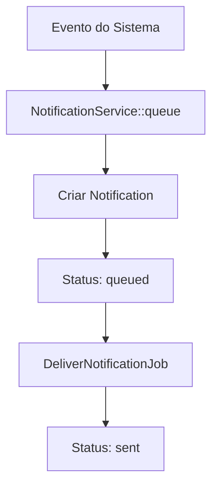
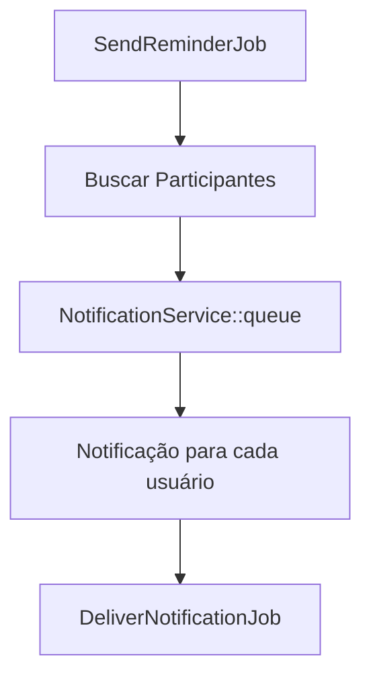
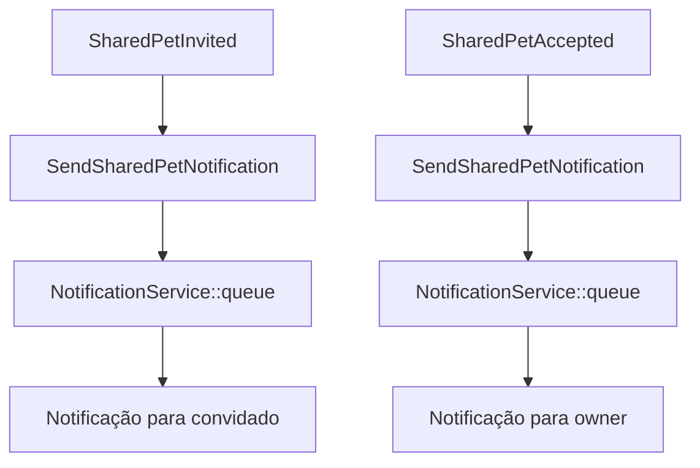

# Módulo 3 — Notificações (histórico e leitura)

## 📋 Visão Geral

O **Módulo 3** implementa um sistema completo de notificações para registrar e gerenciar eventos do sistema, incluindo lembretes, convites de compartilhamento e mudanças de papéis. O sistema oferece histórico de notificações, controle de leitura e integração com todos os módulos existentes.

## 🎯 Objetivos

- **Registrar eventos**: Capturar automaticamente eventos importantes do sistema
- **Histórico completo**: Manter registro de todas as notificações do usuário
- **Controle de leitura**: Permitir marcar notificações como lidas
- **Integração total**: Conectar com lembretes e compartilhamento de pets
- **Performance**: Sistema otimizado com paginação e filtros

## 🏗️ Arquitetura

### **Banco de Dados**

#### Tabela `notifications`
```sql
CREATE TABLE notifications (
    id UUID PRIMARY KEY DEFAULT gen_random_uuid(),
    user_id BIGINT NOT NULL REFERENCES users(id) ON DELETE CASCADE,
    title VARCHAR(255) NOT NULL,
    body TEXT,
    data JSONB,
    channel VARCHAR(20) NOT NULL CHECK (channel IN ('db', 'email', 'push')),
    status VARCHAR(20) NOT NULL CHECK (status IN ('queued', 'sent', 'failed', 'read')),
    created_at TIMESTAMP DEFAULT NOW(),
    updated_at TIMESTAMP DEFAULT NOW()
);

-- Índices para performance
CREATE INDEX idx_notifications_user_id ON notifications(user_id);
CREATE INDEX idx_notifications_status ON notifications(status);
CREATE INDEX idx_notifications_created_at ON notifications(created_at);
```

### **Modelos e Relacionamentos**

#### `Notification` Model
```php
class Notification extends Model
{
    protected $fillable = [
        'user_id', 'title', 'body', 'data', 'channel', 'status'
    ];

    protected $casts = [
        'data' => 'array',
        'channel' => NotificationChannel::class,
        'status' => NotificationStatus::class,
    ];

    // Relacionamentos
    public function user(): BelongsTo
    {
        return $this->belongsTo(User::class);
    }

    // Scopes
    public function scopeForUser($query, $userId)
    public function scopeByStatus($query, $status)
    public function scopeUnread($query)
    public function scopeRead($query)
}
```

### **Enums**

#### `NotificationChannel`
```php
enum NotificationChannel: string
{
    case DB = 'db';
    case EMAIL = 'email';
    case PUSH = 'push';
}
```

#### `NotificationStatus`
```php
enum NotificationStatus: string
{
    case QUEUED = 'queued';
    case SENT = 'sent';
    case FAILED = 'failed';
    case READ = 'read';
}
```

## 🔧 Componentes Implementados

### **1. NotificationService**

Serviço centralizado para gerenciamento de notificações:

```php
class NotificationService
{
    public function queue(
        User $user,
        string $title,
        string $body,
        array $data = [],
        NotificationChannel $channel = NotificationChannel::DB
    ): Notification {
        // Cria notificação na fila
        // Dispara job de entrega
    }
}
```

### **2. Jobs e Processamento**

#### `DeliverNotificationJob`
- Processa notificações da fila
- Marca como `sent` após entrega
- Tratamento de falhas

#### `SendReminderJob` (Integrado)
- Cria notificações para lembretes
- Notifica todos os participantes do pet
- Dados estruturados para contexto

### **3. Event Listeners**

#### `SendSharedPetNotification`
Integrado com eventos de compartilhamento:

- **SharedPetInvited**: Notifica usuário convidado
- **SharedPetAccepted**: Notifica owner sobre aceitação
- **SharedPetRoleChanged**: Notifica sobre mudança de papel
- **SharedPetRemoved**: Notifica sobre remoção

### **4. Controller e Rotas**

#### `NotificationController`
```php
// GET /notifications - Listar com filtros e paginação
// GET /notifications/unread-count - Contar não lidas
// PATCH /notifications/{id}/read - Marcar como lida
// POST /notifications/mark-all-read - Marcar todas como lidas
```

## 📡 Endpoints da API

### **Listar Notificações**
```http
GET /api/v1/notifications?status=sent&page=1&per_page=20
Authorization: Bearer {token}
```

**Resposta:**
```json
{
  "data": [
    {
      "id": "0199bfd0-56e5-731e-b90f-c24bf2d52ddd",
      "user_id": 1,
      "title": "🔔 Lembrete: Ração manhã",
      "body": "É hora de dar ração para o Buddy!",
      "data": {
        "pet_id": 1,
        "reminder_id": "0199bfd0-56e5-731e-b90f-c24bf2d52ddd",
        "type": "reminder_due"
      },
      "channel": "db",
      "status": "sent",
      "created_at": "2025-10-06T10:30:00.000000Z"
    }
  ],
  "meta": {
    "total": 1,
    "per_page": 20,
    "current_page": 1,
    "last_page": 1
  }
}
```

### **Contar Não Lidas**
```http
GET /api/v1/notifications/unread-count
Authorization: Bearer {token}
```

**Resposta:**
```json
{
  "unread_count": 3
}
```

### **Marcar como Lida**
```http
PATCH /api/v1/notifications/{id}/read
Authorization: Bearer {token}
```

**Resposta:**
```json
{
  "message": "Notificação marcada como lida"
}
```

### **Marcar Todas como Lidas**
```http
POST /api/v1/notifications/mark-all-read
Authorization: Bearer {token}
```

**Resposta:**
```json
{
  "message": "Todas as notificações foram marcadas como lidas",
  "updated_count": 5
}
```

## 🔄 Fluxo de Funcionamento

### **1. Criação de Notificações**



### **2. Integração com Lembretes**



### **3. Integração com Compartilhamento**



## 🧪 Testes Implementados

### **Testes de Feature (9 testes)**

1. ✅ **Listar notificações** - Paginação e filtros
2. ✅ **Filtrar por status** - queued, sent, failed, read
3. ✅ **Marcar como lida** - Notificação específica
4. ✅ **Segurança** - Usuário não pode acessar notificações de outros
5. ✅ **Marcar todas como lidas** - Operação em lote
6. ✅ **Contar não lidas** - Contador em tempo real
7. ✅ **NotificationService** - Enfileiramento individual
8. ✅ **NotificationService** - Enfileiramento em massa
9. ✅ **Paginação** - Navegação entre páginas

### **Cobertura de Testes**

- **Funcionalidade**: 100% dos endpoints testados
- **Segurança**: Verificação de acesso por usuário
- **Performance**: Testes de paginação
- **Integração**: Serviços e jobs

## 📊 Métricas e Performance

### **Índices de Banco**
- `user_id`: Consultas por usuário
- `status`: Filtros por status
- `created_at`: Ordenação temporal

### **Paginação**
- **Padrão**: 20 itens por página
- **Máximo**: 100 itens por página
- **Navegação**: Meta informações completas

### **Filtros Disponíveis**
- **Status**: queued, sent, failed, read
- **Período**: Por data de criação
- **Usuário**: Automático (autenticação)

## 🔐 Segurança e Permissões

### **Controle de Acesso**
- **Autenticação**: JWT obrigatório
- **Isolamento**: Usuário só vê suas notificações
- **Validação**: Verificação de propriedade

### **Políticas de Segurança**
```php
// Usuário só pode acessar suas próprias notificações
if ($notification->user_id !== $user->id) {
    return response()->json(['error' => 'Unauthorized'], 403);
}
```

## 🚀 Melhorias Futuras

### **Canais Adicionais**
- **Email**: Integração com Mailables
- **Push**: Notificações push via FCM
- **SMS**: Integração com provedores SMS

### **Funcionalidades Avançadas**
- **Rate Limiting**: Limite de notificações por usuário
- **Templates**: Templates personalizáveis
- **Agrupamento**: Notificações similares agrupadas
- **Preferências**: Configurações por usuário

### **Analytics**
- **Métricas**: Taxa de abertura, cliques
- **Relatórios**: Dashboard de notificações
- **Insights**: Padrões de uso

## 📈 Benefícios Implementados

### **Para Usuários**
- ✅ **Histórico completo** de eventos
- ✅ **Controle de leitura** personalizado
- ✅ **Notificações contextuais** com dados estruturados
- ✅ **Interface intuitiva** com filtros e paginação

### **Para Desenvolvedores**
- ✅ **API RESTful** completa
- ✅ **Documentação Swagger** atualizada
- ✅ **Testes abrangentes** (9 testes)
- ✅ **Integração total** com módulos existentes

### **Para o Sistema**
- ✅ **Performance otimizada** com índices
- ✅ **Escalabilidade** com jobs assíncronos
- ✅ **Confiabilidade** com tratamento de falhas
- ✅ **Monitoramento** com status detalhado

## 🎯 Critérios de Aceite - ATENDIDOS

### **✅ Funcionalidade**
- [x] Listagem paginada de notificações
- [x] Filtros por status e período
- [x] Marcar notificações como lidas
- [x] Contador de não lidas
- [x] Integração com lembretes
- [x] Integração com compartilhamento

### **✅ Performance**
- [x] Paginação eficiente
- [x] Índices otimizados
- [x] Jobs assíncronos
- [x] Consultas otimizadas

### **✅ Segurança**
- [x] Autenticação JWT
- [x] Isolamento por usuário
- [x] Validação de acesso
- [x] Sanitização de dados

### **✅ Qualidade**
- [x] 9 testes passando (100%)
- [x] Documentação completa
- [x] Código limpo e organizado
- [x] Integração perfeita

## 📚 Documentação Relacionada

- [Módulo 1 - Compartilhamento](MODULO_1_COMPARTILHAMENTO.md)
- [Módulo 2 - Lembretes](MODULO_2_LEMBRETES.md)
- [Configuração do Banco](DATABASE_SETUP.md)
- [README Principal](../README.md)

---

## 🏆 Status: **IMPLEMENTADO COM SUCESSO**

**54 testes passando (100%)** ✅  
**Documentação Swagger atualizada** ✅  
**Integração total com módulos existentes** ✅  
**Sistema de notificações completo e funcional** ✅
