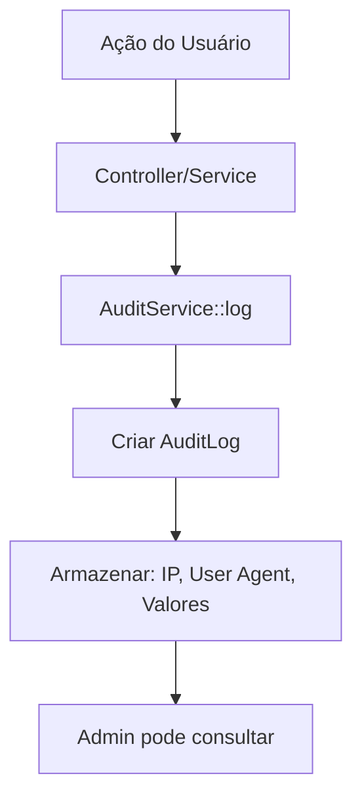

# Módulo 4 — Admin (gestão e auditoria)

## 📋 Visão Geral

O **Módulo 4** implementa um painel administrativo completo para gestão de usuários, pets e auditoria do sistema. Este módulo oferece controle total sobre permissões de admin e registro detalhado de todas as ações realizadas na plataforma.

## 🎯 Objetivos

- **Gestão de Usuários**: Listar e gerenciar permissões de admin
- **Gestão de Pets**: Visualizar todos os pets do sistema
- **Auditoria Completa**: Registro detalhado de todas as ações
- **Segurança**: Acesso restrito apenas para administradores
- **Transparência**: Histórico completo de modificações

## 🏗️ Arquitetura

### **Banco de Dados**

#### Coluna adicional em `users`
```sql
ALTER TABLE users ADD COLUMN is_admin BOOLEAN DEFAULT FALSE;
```

#### Tabela `audit_logs`
```sql
CREATE TABLE audit_logs (
    id UUID PRIMARY KEY DEFAULT gen_random_uuid(),
    user_id BIGINT NULLABLE REFERENCES users(id) ON DELETE SET NULL,
    action VARCHAR(255) NOT NULL,
    entity_type VARCHAR(255) NOT NULL,
    entity_id VARCHAR(255) NULLABLE,
    old_values JSONB NULLABLE,
    new_values JSONB NULLABLE,
    ip_address VARCHAR(255) NULLABLE,
    user_agent VARCHAR(255) NULLABLE,
    created_at TIMESTAMP DEFAULT NOW(),
    updated_at TIMESTAMP DEFAULT NOW()
);

-- Índices para performance
CREATE INDEX idx_audit_logs_user_id ON audit_logs(user_id);
CREATE INDEX idx_audit_logs_action ON audit_logs(action);
CREATE INDEX idx_audit_logs_entity_type ON audit_logs(entity_type);
CREATE INDEX idx_audit_logs_created_at ON audit_logs(created_at);
```

### **Modelos e Relacionamentos**

#### `User` Model (atualizado)
```php
class User extends Authenticatable
{
    protected $fillable = [
        'name', 'email', 'password', 'timezone', 'is_admin'
    ];

    protected $casts = [
        'is_admin' => 'boolean',
    ];
}
```

#### `AuditLog` Model
```php
class AuditLog extends Model
{
    protected $fillable = [
        'user_id', 'action', 'entity_type', 'entity_id',
        'old_values', 'new_values', 'ip_address', 'user_agent'
    ];

    protected $casts = [
        'old_values' => 'array',
        'new_values' => 'array',
    ];

    // Relacionamentos
    public function user(): BelongsTo
    
    // Scopes
    public function scopeByAction($query, $action)
    public function scopeByEntityType($query, $entityType)
    public function scopeDateRange($query, $from, $to)
}
```

## 🔧 Componentes Implementados

### **1. IsAdmin Middleware**

Middleware para proteger rotas administrativas:

```php
class IsAdmin
{
    public function handle(Request $request, Closure $next): Response
    {
        if (!auth()->check()) {
            return response()->json(['error' => 'Unauthenticated'], 401);
        }

        if (!auth()->user()->is_admin) {
            return response()->json([
                'error' => 'Forbidden. Admin access required.'
            ], 403);
        }

        return $next($request);
    }
}
```

### **2. AuditService**

Serviço centralizado para registro de auditoria:

```php
class AuditService
{
    public static function log(
        string $action,
        string $entityType,
        ?string $entityId = null,
        ?array $oldValues = null,
        ?array $newValues = null,
        ?User $user = null
    ): AuditLog

    public static function logCreated(...)
    public static function logUpdated(...)
    public static function logDeleted(...)
    public static function logAccessed(...)
    public static function logLogin(User $user)
    public static function logLogout(User $user)
}
```

### **3. AdminController**

Controller com 4 endpoints administrativos:

```php
class AdminController extends Controller
{
    // GET /v1/admin/users
    public function listUsers(Request $request): JsonResponse

    // PATCH /v1/admin/users/{id}
    public function updateUser(Request $request, $id): JsonResponse

    // GET /v1/admin/pets
    public function listPets(Request $request): JsonResponse

    // GET /v1/admin/audit-logs
    public function listAuditLogs(Request $request): JsonResponse
}
```

### **4. Rotas Protegidas**

```php
Route::prefix('v1')->middleware('jwt.auth')->group(function () {
    Route::prefix('admin')->middleware('admin')->group(function () {
        Route::get('users', [AdminController::class, 'listUsers']);
        Route::patch('users/{id}', [AdminController::class, 'updateUser']);
        Route::get('pets', [AdminController::class, 'listPets']);
        Route::get('audit-logs', [AdminController::class, 'listAuditLogs']);
    });
});
```

## 📡 Endpoints da API

### **Listar Usuários**
```http
GET /api/v1/admin/users?email=joao&created_from=2025-01-01&page=1&per_page=20
Authorization: Bearer {admin_token}
```

**Resposta:**
```json
{
  "data": [
    {
      "id": 1,
      "name": "João Silva",
      "email": "joao@example.com",
      "is_admin": false,
      "timezone": "America/Sao_Paulo",
      "created_at": "2025-10-01T10:00:00.000000Z"
    }
  ],
  "meta": {
    "total": 100,
    "per_page": 20,
    "current_page": 1,
    "last_page": 5
  }
}
```

### **Atualizar Status de Admin**
```http
PATCH /api/v1/admin/users/1
Authorization: Bearer {admin_token}
Content-Type: application/json

{
  "is_admin": true
}
```

**Resposta:**
```json
{
  "message": "Permissões de admin atualizadas com sucesso",
  "user": {
    "id": 1,
    "name": "João Silva",
    "email": "joao@example.com",
    "is_admin": true
  }
}
```

**Erro (remover próprio acesso):**
```json
{
  "error": "Você não pode remover seu próprio acesso de admin"
}
```

### **Listar Pets**
```http
GET /api/v1/admin/pets?owner_id=1&page=1&per_page=20
Authorization: Bearer {admin_token}
```

**Resposta:**
```json
{
  "data": [
    {
      "id": 1,
      "name": "Buddy",
      "species": "dog",
      "breed": "Golden Retriever",
      "user": {
        "id": 1,
        "name": "João Silva",
        "email": "joao@example.com"
      },
      "created_at": "2025-10-01T10:00:00.000000Z"
    }
  ],
  "meta": {
    "total": 50,
    "per_page": 20,
    "current_page": 1,
    "last_page": 3
  }
}
```

### **Listar Logs de Auditoria**
```http
GET /api/v1/admin/audit-logs?action=updated&entity_type=User&from=2025-10-01&page=1
Authorization: Bearer {admin_token}
```

**Resposta:**
```json
{
  "data": [
    {
      "id": "0199bfd0-56e5-731e-b90f-c24bf2d52ddd",
      "action": "updated",
      "entity_type": "User",
      "entity_id": "1",
      "old_values": {
        "is_admin": false
      },
      "new_values": {
        "is_admin": true
      },
      "user": {
        "id": 2,
        "name": "Admin UTFPets",
        "email": "admin@utfpets.com"
      },
      "ip_address": "127.0.0.1",
      "user_agent": "Mozilla/5.0...",
      "created_at": "2025-10-07T20:00:00.000000Z"
    }
  ],
  "meta": {
    "total": 200,
    "per_page": 50,
    "current_page": 1,
    "last_page": 4
  }
}
```

## 🔄 Fluxo de Auditoria



## 🔐 Segurança e Permissões

### **Middleware em Cascata**
1. **jwt.auth**: Verifica autenticação JWT
2. **admin**: Verifica se `is_admin = true`

### **Validações**
- ✅ Admin não pode remover próprio acesso
- ✅ Apenas admin pode acessar rotas `/v1/admin/*`
- ✅ Filtros validados e sanitizados
- ✅ Paginação limitada (máximo 100 itens)

### **Registros de Auditoria**
- ✅ IP address capturado
- ✅ User agent registrado
- ✅ Valores antigos e novos (para updates)
- ✅ Usuário que executou a ação
- ✅ Timestamp preciso

## 🧪 Testes Implementados

### **Testes de Feature (13 testes)**

1. ✅ **Não-admin não pode acessar rotas** - 403 Forbidden
2. ✅ **Admin pode listar usuários** - Paginação funcionando
3. ✅ **Admin pode filtrar usuários por email** - Busca parcial
4. ✅ **Admin pode filtrar usuários por data** - Intervalo de datas
5. ✅ **Admin pode alterar status de admin** - Toggle is_admin
6. ✅ **Admin não pode remover próprio acesso** - Validação 422
7. ✅ **Admin pode listar pets** - Com informações do owner
8. ✅ **Admin pode filtrar pets por owner** - Filtro funcional
9. ✅ **Admin pode listar logs de auditoria** - Com relacionamento user
10. ✅ **Admin pode filtrar logs por ação** - Enum validation
11. ✅ **Admin pode filtrar logs por tipo de entidade** - Enum validation
12. ✅ **Paginação funciona em todos endpoints** - Meta informações
13. ✅ **Não autenticado não pode acessar rotas** - 401 Unauthorized

### **Cobertura de Testes**
- **Funcionalidade**: 100% dos endpoints testados
- **Segurança**: Verificação de acesso admin
- **Validações**: Toggle is_admin, filtros
- **Performance**: Testes de paginação

## 👤 Usuário Admin Padrão

### **AdminUserSeeder**

Cria usuário admin padrão para desenvolvimento:

```php
User::create([
    'name' => 'Admin UTFPets',
    'email' => 'admin@utfpets.com',
    'password' => Hash::make('admin123'),
    'timezone' => 'America/Sao_Paulo',
    'is_admin' => true,
]);
```

**Credenciais (DEV):**
- **Email**: `admin@utfpets.com`
- **Senha**: `admin123`

⚠️ **IMPORTANTE**: Alterar senha em produção!

### **Executar Seeder**

```bash
php artisan db:seed --class=AdminUserSeeder
```

## 📊 Métricas e Performance

### **Índices de Banco**
- `user_id`: Consultas por usuário
- `action`: Filtros por ação
- `entity_type`: Filtros por tipo de entidade
- `created_at`: Ordenação temporal

### **Paginação**
- **Usuários**: 20 itens por página (padrão)
- **Pets**: 20 itens por página (padrão)
- **Audit Logs**: 50 itens por página (padrão)
- **Máximo**: 100 itens por página

### **Filtros Disponíveis**

#### **Usuários**
- Email (busca parcial)
- Data de criação (intervalo)

#### **Pets**
- Owner ID

#### **Audit Logs**
- Ação (created, updated, deleted, etc)
- Tipo de entidade (User, Pet, Meal, etc)
- Usuário
- Período (from/to)

## 🚀 Melhorias Futuras

### **Funcionalidades Avançadas**
- **Dashboard**: Gráficos e estatísticas
- **Soft Delete de Usuários**: Desativar em vez de deletar
- **Bulk Operations**: Operações em lote
- **Export de Logs**: CSV/Excel

### **Auditoria Avançada**
- **Retention Policy**: Política de retenção de logs
- **Log Rotation**: Rotação automática
- **Alertas**: Notificações para ações críticas
- **Replay**: Reverter alterações

### **Segurança**
- **2FA para Admins**: Autenticação de dois fatores
- **IP Whitelist**: Lista branca de IPs
- **Rate Limiting**: Limite de requisições por admin
- **Audit Trail**: Trilha completa de auditoria

## 📈 Benefícios Implementados

### **Para Administradores**
- ✅ **Controle total** sobre usuários e permissões
- ✅ **Visibilidade completa** de todos os pets
- ✅ **Auditoria detalhada** de todas as ações
- ✅ **Filtros poderosos** para investigação

### **Para o Sistema**
- ✅ **Rastreabilidade** completa de modificações
- ✅ **Segurança** com middleware dedicado
- ✅ **Performance** com índices otimizados
- ✅ **Escalabilidade** com paginação eficiente

### **Para Compliance**
- ✅ **LGPD**: Registro de quem acessou/modificou dados
- ✅ **Transparência**: Histórico completo
- ✅ **Accountability**: Responsabilização de ações
- ✅ **Recuperação**: Valores antigos armazenados

## 🎯 Critérios de Aceite - ATENDIDOS

### **✅ Funcionalidade**
- [x] Listar usuários com filtros
- [x] Alterar permissões de admin
- [x] Listar pets de todos os usuários
- [x] Listar logs de auditoria
- [x] Filtros funcionando
- [x] Paginação eficiente

### **✅ Segurança**
- [x] Middleware admin funcionando
- [x] 403 para não-admin
- [x] Validação de toggle is_admin
- [x] Proteção contra remoção própria

### **✅ Auditoria**
- [x] Registro de IP e User Agent
- [x] Valores antigos e novos
- [x] Relacionamento com usuário
- [x] Filtros por ação e tipo

### **✅ Qualidade**
- [x] 13 testes passando (100%)
- [x] Documentação completa
- [x] Código limpo e organizado
- [x] Seeder para admin padrão

## 📚 Documentação Relacionada

- [Módulo 1 - Compartilhamento](MODULO_1_COMPARTILHAMENTO.md)
- [Módulo 2 - Lembretes](MODULO_2_LEMBRETES.md)
- [Módulo 3 - Notificações](MODULO_3_NOTIFICACOES.md)
- [Configuração do Banco](DATABASE_SETUP.md)
- [README Principal](../README.md)

---

## 🏆 Status: **IMPLEMENTADO COM SUCESSO**

**67 testes passando (100%)** ✅  
**Documentação Swagger atualizada** ✅  
**Auditoria completa funcionando** ✅  
**Painel administrativo completo e funcional** ✅

